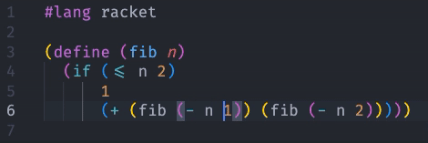
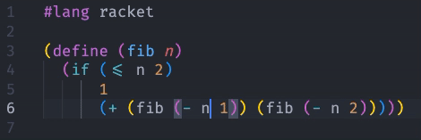
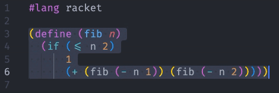

# Racket Helpers

## Features

### Hoist S-expression

command: `racket-helpers.hoistExpression`

keybinding: `ctrl+shift+h`

### Expand Selection to Parent S-expression

command: `racket-helpers.expandSelection`

keybinding: `ctrl+shift+↑`

### Shrink S-expression Selection

command: `racket-helpers.shrinkSelection`

keybinding: `ctrl+shift+↓`

